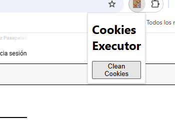
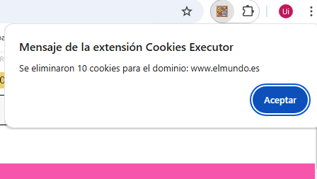

### Instruciones en Español:
1. Descargar la carpeta completa con todos los archivos ,
2. entra al navegador google chrome, 
3. ve  a la parte de extensiones , 
4. selecciona el modo desarrollador,
5. seleciona la opcion cargar descomprimida y sube la carpeta cookies_executor,
6.Una vez subida deberas activar la extension y ya estará lista para usarse
---------

### English Instructions
1. Download the complete folder with all the files, 
2. enter the Google Chrome browser,
3. go to the extensions part,
4. select developer mode,
5. Select the upload unzipped option and upload the cookies_executor folder.
6. Once uploaded you must activate the extension, and it will be ready to use

   ## How to use it / Como usarlo

____
**Haz click en 'Clean Cookies'**
____
**Click on button 'Clean Cookies'**
____

____
**Una vez borradas las cookies , dale a aceptar**
____
**Once the cookies have been deleted, click to accept**
_____

